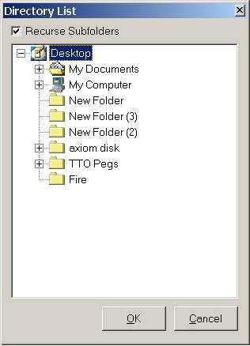



## Advanced Directory List

### Description

This gives you the Windows 95+ directory listing with My Documents, Desktop, etc. Two projects are included in this zip, one that has the project as an executable, one that has it as an ActiveX usercontrol. Simple code, lots of comments.

Please leave feedback and vote!
 
### More Info
 

             |
---                |---
**Submitted On**   |2001-02-14 06:03:46
**By**             |[Minnow](https://github.com/Planet-Source-Code/PSCIndex/blob/master/ByAuthor/minnow.md)
**Level**          |Intermediate
**User Rating**    |5.0 (20 globes from 4 users)
**Compatibility**  |VB 4\.0 \(32\-bit\), VB 5\.0, VB 6\.0
**Category**       |[Files/ File Controls/ Input/ Output](https://github.com/Planet-Source-Code/PSCIndex/blob/master/ByCategory/files-file-controls-input-output__1-3.md)
**World**          |[Visual Basic](https://github.com/Planet-Source-Code/PSCIndex/blob/master/ByWorld/visual-basic.md)
**Archive File**   |[CODE\_UPLOAD149632142001\.zip](https://github.com/Planet-Source-Code/minnow-advanced-directory-list__1-21004/archive/master.zip)

